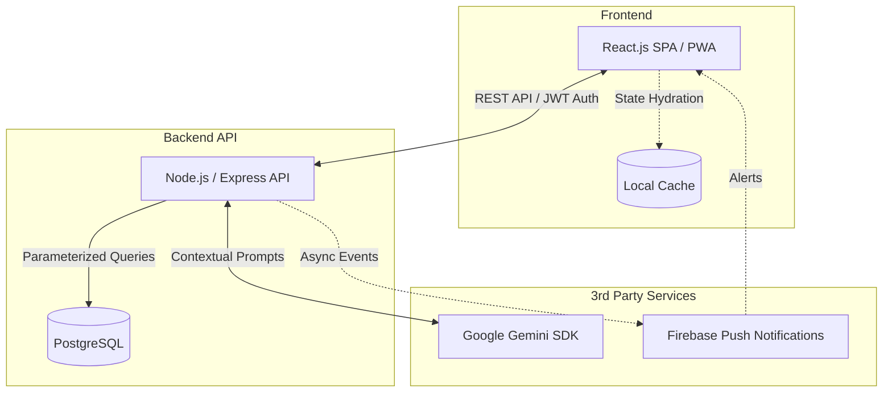

# SIAKAD DKN: AI-Powered Academic Information System 🎓


A modern, production-ready Academic Information System (SIAKAD) architected to streamline university operations. Integrated with the Google Gemini AI ecosystem, this platform automates grading, enhances academic integrity, and provides 24/7 intelligent assistance for students and faculty.

> **Status:** Active in production. Currently handling daily academic operations, real-time examinations, and student management for a higher education institution.

---

## 📸 System Previews

*(Replace these placeholders with actual screenshots or GIFs of your application)*

| Lecturer Dashboard | Student Exam Interface | AI Chatbot "Pak Dwi" |
|:---:|:---:|:---:|
|  |  |  |

---

## ✨ Key Features

### 🧑‍🏫 Faculty & Lecturer Operations
- **Comprehensive Class Management**: End-to-end management of lecture schedules, syllabuses (RPS), and attendance tracking.
- **AI-Assisted Material & Exam Generation**: Leverage LLMs to summarize curriculum topics into structured HTML modules and bulk-generate contextual exam questions.
- **Automated Essay Evaluation**: Built-in AI grading engine that evaluates student essays, provides instant constructive feedback, and flags potential AI-generated or plagiarized submissions.
- **One-Click Export**: Generate print-ready DOCX files for examination archives with dynamic institutional headers.

### 👨‍🎓 Student Experience
- **Unified Academic Portal**: Real-time access to schedules, grades (KHS), assignments, and lecture materials.
- **Proactive Exam Integrity (CBT)**: A secure examination environment featuring clipboard restrictions, tab-switching detection, and automated force-submission policies to maintain academic honesty.
- **"Pak Dwi" AI Academic Advisor**: A fine-tuned 24/7 contextual chatbot designed to guide students through course materials based on the active syllabus, strictly filtered to prevent direct assignment resolution.

---

## 🏛️ System Architecture

Built on a decoupled client-server architecture to ensure scalability and maintainability.



---

## 📈 Security & Implementation Standards

To ensure data integrity and system reliability during high-concurrency events (e.g., university-wide midterm exams), the application implements robust engineering practices:

- **Data Access Layer Security**: Mitigates SQL injection risks globally by exclusively utilizing parameterized statements and native query bindings across the data layer.
- **API Defense Mechanisms**: Implements strict Role-Based Access Control (RBAC) via cryptographically signed JWTs. Features payload stripping at the controller level to ensure sensitive data (e.g., correct exam answers) is never exposed to the client network tab.
- **Frontend Integrity**: Utilizes the Page Visibility API and DOM event listeners to restrict unauthorized copy-pasting and track application focus during active exam sessions.
- **Resilient AI Integration**: The Google Generative AI SDK wrapper is engineered with an intelligent key-rotation system and exponential backoff retry mechanisms to prevent service disruption during rate limits.
- **Production Infrastructure**: The live environment is battle-tested behind a Web Application Firewall (WAF) to mitigate Layer 7 volumetric anomalies.

---

## 🛠️ Tech Stack

**Frontend**
* React.js (Vite)
* Bootstrap / Custom CSS
* Progressive Web App (PWA) configuration

**Backend**
* Node.js / Express.js
* PostgreSQL (Native driver)
* JSON Web Token (JWT) + bcryptjs

**AI & Utilities**
* `@google/generative-ai`
* `docx` (Document Generation)

---

## 🚀 Local Development Setup

Ensure you have **Node.js (v18+)** and **PostgreSQL** installed on your local machine.

### 1. Clone the Repository
```bash
git clone https://github.com/dwikrisnandi/siakad-dkn-dkn.git
cd siakad-dkn-dkn
```

### 2. Backend & Database Setup
```bash
cd api
npm install
```

Create a `.env` file in the `api` directory:
```env
PORT=3000
DB_HOST=localhost
DB_PORT=5432
DB_USER=postgres
DB_PASSWORD=your_password
DB_NAME=siakad_db
JWT_SECRET=your_development_secret
GEMINI_API_KEY_1=your_google_ai_studio_key
```

Start the API:
```bash
npm start
```
*The API will be available at `http://localhost:3000`*

### 3. Frontend Setup
Open a new terminal window:
```bash
cd client
npm install
npm run dev
```
*The client application will run at `http://localhost:5173`*

---

## 📜 License
Developed and architected by **Dwi Krisnandi**. 
For business inquiries, deployment consultations, or white-label licensing, please reach out via GitHub issues or email.
