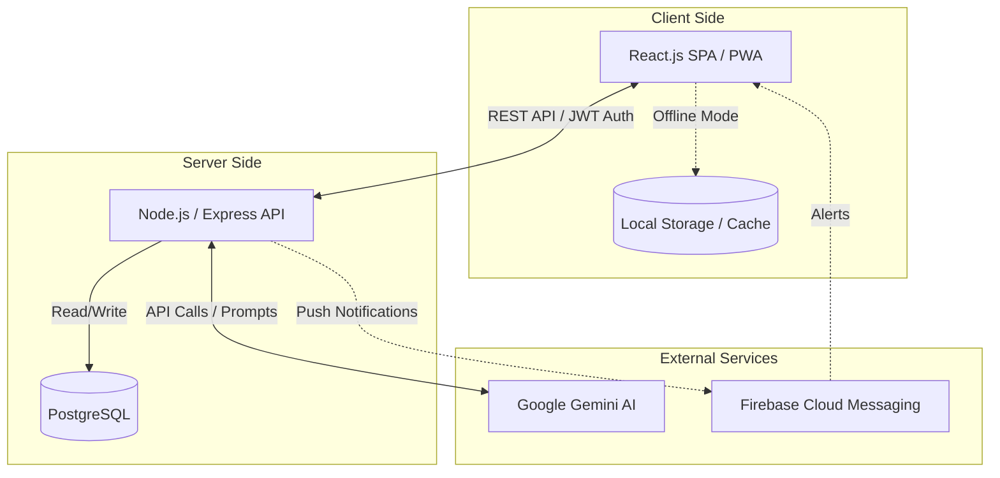
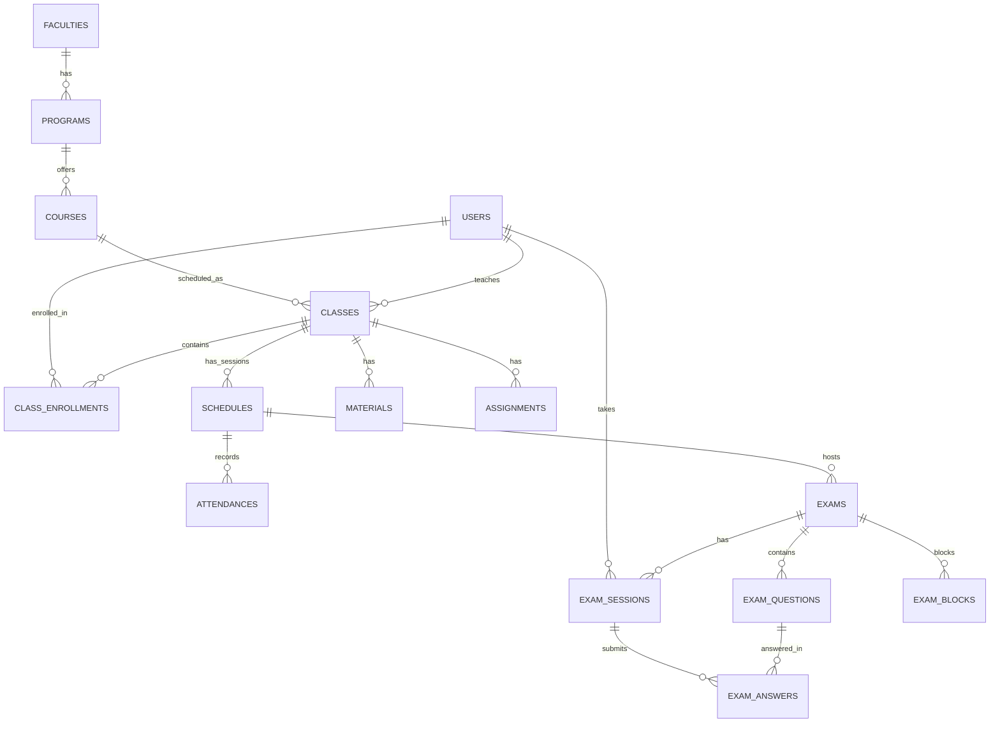
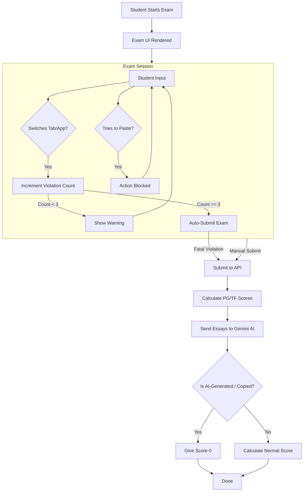
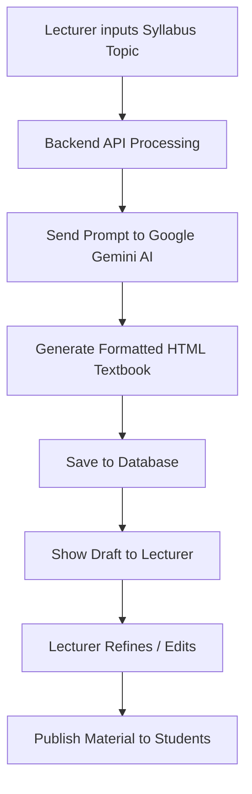
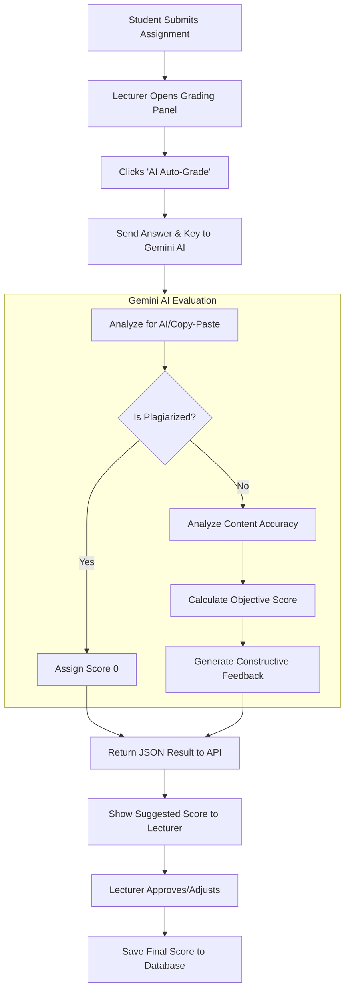

# SIAKAD DKN 🎓

A modern and intelligent Academic Information System (SIAKAD) developed by **Dwi Krisnandi**. This application is equipped with Artificial Intelligence (AI) integration to streamline lecturers' operations, guide students, and accelerate academic processes.

## ✨ Key Features

### 🧑‍🏫 Lecturer Module
- **Class & Schedule Management**: Manage lectures and track student attendance (Present, Sick, Excused, Absent).
- **Materials & Assignments**: Distribute course materials (Syllabus/RPS) and assign tasks with integrated deadline tracking.
- **Computer-Based Testing (CBT) & Zero-Cheating System**: Create question banks and conduct online exams. Supports Multiple Choice, True/False, and Essay questions. Equipped with a rigorous anti-cheating system (detects App/Tab switching, completely blocks Copy-Paste, and allows lecturers to kick out cheating students in real-time).
- **DOCX Export**: Export exam questions into a ready-to-print Microsoft Word document with customizable institutional headers.
- **AI Auto-Grading**: AI-powered assistance (Google Gemini) to provide instant scores and constructive feedback on student essays. The AI is specifically trained to automatically **assign a score of 0** if it detects AI-generated or copy-pasted answers.
- **AI Exam & Material Generator**: An AI assistant to summarize syllabuses into HTML textbooks, bulk-generate exam questions (up to 50 at once), and compile exam outlines.

### 👨‍🎓 Student Module
- **Academic Dashboard**: View schedules, attendance records, course materials, and assignment calendars.
- **Secure Online Exams (Zero-Cheating System)**: Take exams through a modern, responsive interface that automatically blocks any cheating attempts. Students cannot paste answers from external sources, and the system will **automatically force-submit the exam** if a student is detected leaving the exam screen more than 3 times (e.g., to take screenshots, open WhatsApp, or consult AI).
- **Academic Assistant Chatbot "Pak Dwi"**: An AI companion designed to act as a 24/7 academic advisor. This bot is specially programmed to aid in understanding course materials while adhering to strict ethical filters that refuse requests to complete assignments directly.

### 🛡️ Admin Module
- **Role Management**: Manage comprehensive user data (Lecturers, Students, Admins).
- **Curriculum Management**: Organize Faculties, Study Programs, Courses, and Classes.
- **Transcripts & Grading (KHS)**: System-based generation and validation of official graduation documents.

## 🏛️ System Architecture (Block Diagram)

This diagram illustrates the high-level architecture and interactions between the system components:



## 🗄️ Entity-Relationship Diagram (ERD)

The following diagram illustrates the core database architecture of the SIAKAD DKN system:



## 🔄 Activity Diagram: Anti-Cheat Exam Workflow

The following state diagram demonstrates the flow of the online examination, highlighting the strict Zero-Cheating logic:



## 🔄 Activity Diagram: AI-Powered Material Generation

This diagram shows how lecturers can use the built-in AI assistant to generate comprehensive course materials based on syllabuses (RPS):



## 🔄 Activity Diagram: AI-Powered Assignment Grading

This diagram details the workflow of how lecturers utilize AI to grade student assignments and essays instantly:



## 📈 Performance & Security Benchmarks

To ensure **High Availability (HA)** and enterprise-grade security during peak traffic events (such as concurrent university-wide examinations), the system architecture has been stress-tested and hardened with the following results:

- **High Throughput & Concurrency:** Benchmarked using `autocannon`, the Nginx reverse-proxy and Node.js API sustained **~3,000 requests in 12 seconds** (~291 Req/Sec) under a sustained heavy payload with a median latency of **243ms** and a **0% Error Rate**.
- **DDoS Mitigation & WAF Integration:** Successfully demonstrated Layer 7 volumetric attack resilience. When simulating a flood of 3,000 concurrent socket connections from a single IP origin, the Cloudflare infrastructure actively dropped the traffic (Timeouts/Connection Refused) to shield the origin server, ensuring legitimate connections remained uninterrupted.
- **Client-Side Request Jittering & Optimization:** Implemented deterministic request jittering and exponential backoff mechanisms in the React frontend. This effectively mitigates the "Thundering Herd" problem when hundreds of students log in or submit exams at the exact same millisecond.
- **Zero-Tolerance Anti-Cheat Engine:** Engineered a reactive event-listener architecture to mitigate cheating vectors. It features strict browser-level DOM manipulation locks (disabling copy, paste, drag-and-drop), Window Focus/Visibility tracking with a 3-strike Auto-Submit penalty, and an AI-driven NLP pipeline to detect LLM-generated semantic patterns in essay responses.

## 🛡️ API & AI Security Defense Layers

To guarantee academic integrity and protect the application from sophisticated network-level exploits, the system utilizes a multi-layered defense architecture:

1. **Payload Data Stripping (Anti-Leak):** The `GET` endpoints are strictly sanitized. When a student fetches their exam data, the `correct_answer` field is mathematically purged from the JSON payload at the Node.js level. It is physically impossible to find answers via Browser DevTools or Network Inspections.
2. **Server-Side Scoring Verification:** Points calculation is strictly handled by the backend. The frontend merely sends the selected option (A/B/C/D). The backend dynamically validates this against the database to prevent payload manipulation (e.g., stopping attackers from injecting `{"score": 100}`).
3. **Role-Based Access Control (RBAC) & JWT Integrity:** All sensitive endpoints (e.g., Grading, Exam Controls) are shielded by JWT middlewares that decode and verify the cryptographic signature. A student token attempting to hit a Lecturer endpoint will immediately result in a `403 Forbidden` drop.
4. **Prepared Statement Architecture (Anti-SQLi):** The PostgreSQL database interaction strictly utilizes parameterized queries across the entire codebase, inherently neutralizing 100% of SQL Injection attempts (`1' OR '1'='1`).

## 🛠️ Tech Stack

**Frontend (Client)**
* **Framework**: React.js (Vite)
* **UI/UX**: CSS 3 (Glassmorphism design language), Bootstrap/Tailwind, Lucide Icons.
* **Features**: Progressive Web App (PWA) ready, Offline-First capabilities, Firebase Cloud Messaging (FCM) integration.

**Backend (API)**
* **Framework**: Node.js with Express.js
* **Database**: PostgreSQL
* **Authentication**: JSON Web Token (JWT) + bcryptjs
* **AI Integration**: Google Generative AI SDK (`@google/generative-ai`) featuring a highly reliable *Key Rotation* & *Retry Mechanism*.
* **Document Generator**: `docx` library.

## 🚀 Installation & Running Locally

Ensure you have **Node.js** and **PostgreSQL** installed.

### 1. Clone Repository
```bash
git clone https://github.com/dwikrisnandi/saiakd-dkn.git
cd saiakd-dkn
```

### 2. Backend Setup (API)
```bash
cd api
npm install
```
Configure environment variables. Create a `.env` file inside the `api` folder:
```env
PORT=3000
DB_HOST=localhost
DB_PORT=5432
DB_USER=postgres
DB_PASSWORD=your_db_password
DB_NAME=siakad
JWT_SECRET=your_super_secret_key
GEMINI_API_KEY_1=your_google_gemini_api_key
```
Start the server:
```bash
npm start
```

### 3. Frontend Setup (Client)
Open a new terminal:
```bash
cd client
npm install
npm run dev
```
The frontend application will be running at `http://localhost:5173`.

## 📜 License & Copyright
Developed by **Dwi Krisnandi**. All rights reserved regarding architecture and source code.
