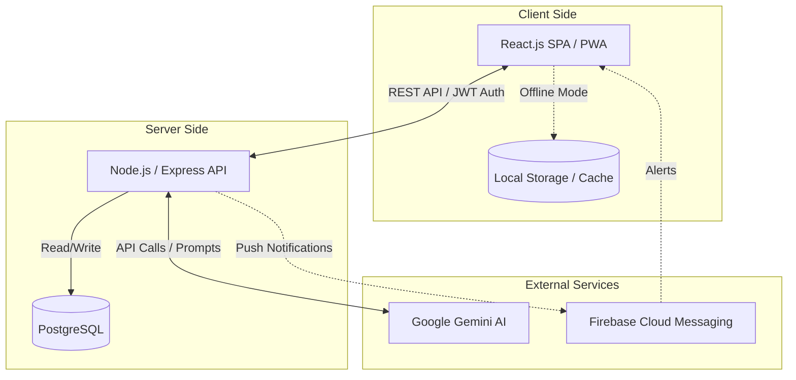
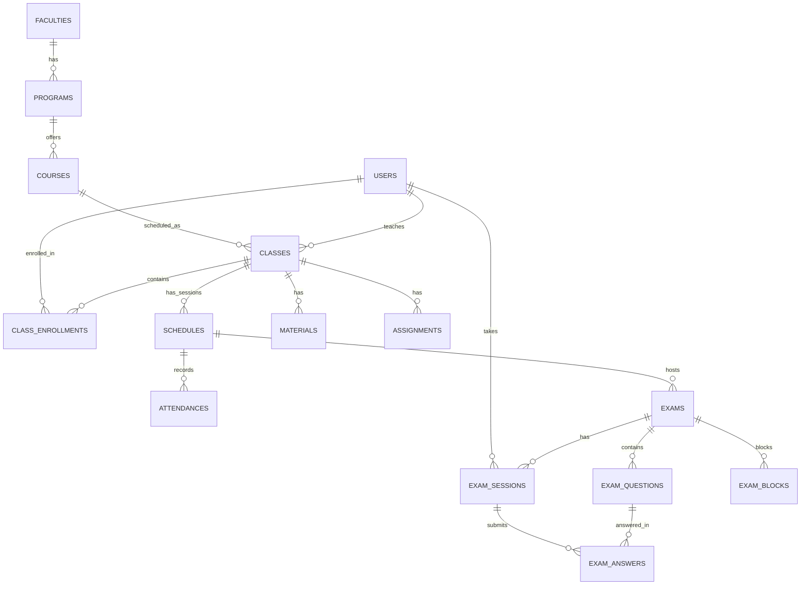
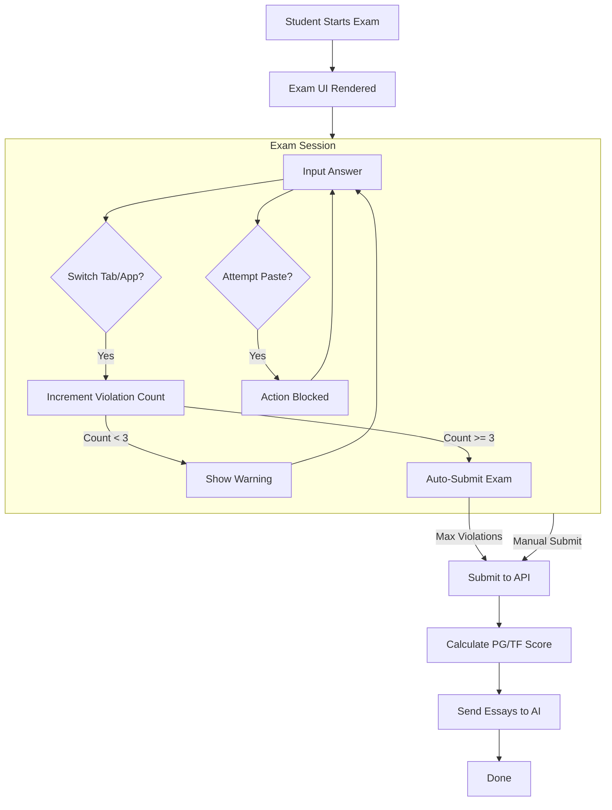
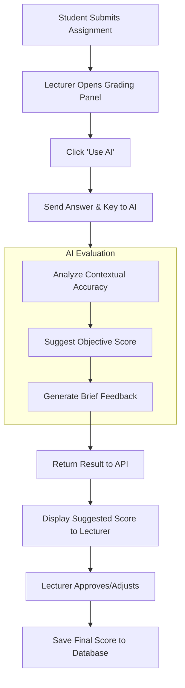

# SIAKAD DKN 🎓

A web-based Academic Information System (SIAKAD) developed by **Dwi Krisnandi**. This application is equipped with basic Artificial Intelligence (AI) integrations to assist lecturers, students, and streamline academic operations.

## ✨ Key Features

### 🧑‍🏫 Lecturer Module
- **Class & Schedule Management**: Manage course schedules and record student attendance (Present, Sick, Excused, Absent).
- **Materials & Assignments**: Distribute course materials and assign coursework to students.
- **Online Examination (CBT)**: Create question banks and conduct online exams (Multiple Choice, True/False, and Essay). Equipped with basic anti-cheat mechanisms (detecting browser tab switching and blocking copy-paste operations).
- **DOCX Export**: Generate and export exam questions into ready-to-print Microsoft Word documents.
- **AI-Assisted Auto-Grading**: Utilizes Google Gemini integration to provide grading suggestions and brief feedback on student essay responses.
- **AI Generator**: An AI assistant to summarize syllabuses into reading materials and generate bulk drafts of multiple-choice questions.

### 👨‍🎓 Student Module
- **Academic Dashboard**: View class schedules, attendance history, materials, and assignment calendars.
- **Online Examination**: Take exams via a responsive interface. Includes threshold warnings; if a student frequently switches tabs or navigates away from the exam page, the system will automatically force-submit their exam.
- **"Pak Dwi" Assistant Chatbot**: An AI-based chatbot feature allowing students to ask questions and discuss course materials.

### 🛡️ Admin Module
- **User Management**: Manage Lecturer, Student, and Admin records.
- **Curriculum Management**: Manage Faculties, Study Programs, Courses, and Classes.
- **Transcripts & Grading (KHS)**: Generate exam results and student graduation documents.

## 🏛️ System Architecture (Block Diagram)

The following diagram illustrates the high-level architecture of the system components:



## 🗄️ Entity-Relationship Diagram (ERD)

Core database structure of SIAKAD DKN:



## 🔄 Activity Diagram: Student Exam Workflow

Online exam execution flow, including tab/screen monitoring logic during an active session:



## 🔄 Activity Diagram: AI-Assisted Auto-Grading

Workflow for lecturers utilizing AI to assist in grading student essay responses:



## ⚙️ System Design & Security Posture

The system is designed with defense-in-depth and fault-tolerance principles to ensure reliability during concurrent load spikes (e.g., simultaneous exams) and to mitigate standard security vulnerabilities.

- **Thundering Herd Mitigation (Client-Side Jittering)**: Implemented a randomized jitter algorithm on the frontend when hundreds of clients start an exam simultaneously. This evenly distributes the request rate over a specified time window, preventing CPU spikes and connection timeouts at the API Gateway.
- **Data Minimization & DTO Mapping**: Exam data serialization utilizes strict Data Transfer Object (DTO) mapping at the service layer. Sensitive fields such as `correct_answer` are systematically stripped prior to payload dispatch over the network, ensuring zero-leakage via client-side Network Tab inspection.
- **Offline-First Resilience**: To address intermittent network partitions, the client architecture leverages IndexedDB and localStorage to temporarily persist exam states. Answer payloads are queued locally and synchronized asynchronously once connectivity is restored.
- **State Integrity & Zero Trust**: Employs a zero-trust approach toward client inputs. All critical state mutations (e.g., score calculations) are executed exclusively server-side. The client only transmits event actions (the selected option letter), ensuring that client-side state manipulation cannot alter the ground truth in the database.
- **Access Control & Sanitization**: Authentication and authorization are enforced at the middleware tier using JSON Web Tokens (stateless auth) combined with Role-Based Access Control (RBAC). The Data Access Layer comprehensively uses parameterized queries to categorically prevent SQL injection vulnerabilities.

## 🛠️ Tech Stack

**Frontend (Client)**
* **Framework**: React.js (Vite)
* **Styling**: CSS / Bootstrap, Lucide Icons.
* **Additional Features**: Progressive Web App (PWA) ready, basic Offline-First caching, Firebase Cloud Messaging (FCM) integration.

**Backend (API)**
* **Framework**: Node.js with Express.js
* **Database**: PostgreSQL (or SQLite)
* **Authentication**: JSON Web Token (JWT) & bcryptjs
* **AI Integration**: Google Generative AI SDK (`@google/generative-ai`).
* **Document Generator**: `docx` library.

## 🚀 Installation & Running Locally

Ensure you have **Node.js** and **PostgreSQL/SQLite** installed on your system.

### 1. Clone Repository
```bash
git clone https://github.com/dwikrisnandi/saiakd-dkn.git
cd saiakd-dkn
```

### 2. Backend Setup (API)
```bash
cd api
npm install
```
Configure environment variables by creating a `.env` file inside the `api` directory:
```env
PORT=3000
DB_HOST=localhost
DB_PORT=5432
DB_USER=postgres
DB_PASSWORD=your_db_password
DB_NAME=siakad
JWT_SECRET=your_jwt_secret
GEMINI_API_KEY_1=your_gemini_api_key
```
Start the server:
```bash
npm start
```

### 3. Frontend Setup (Client)
Open a new terminal session:
```bash
cd client
npm install
npm run dev
```
The frontend application will run at `http://localhost:5173`.

## 📜 License & Copyright
Developed by **Dwi Krisnandi**.
