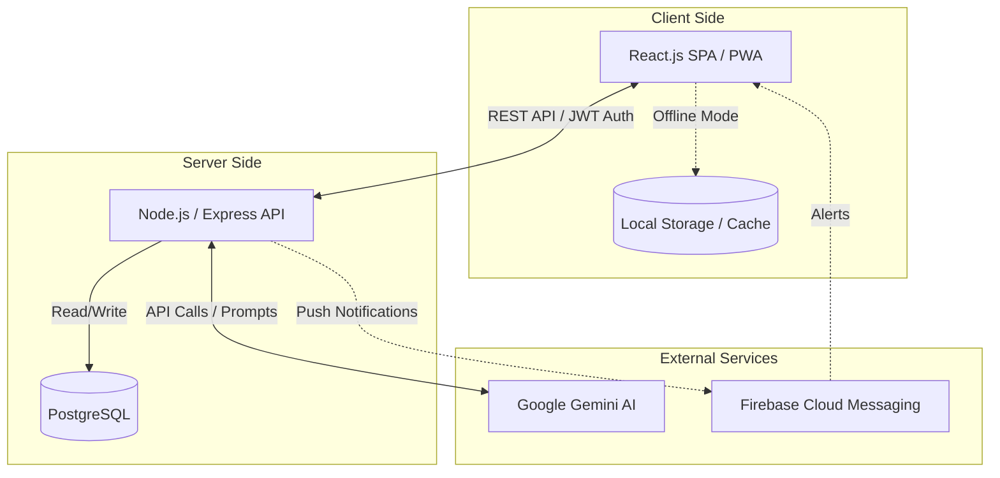
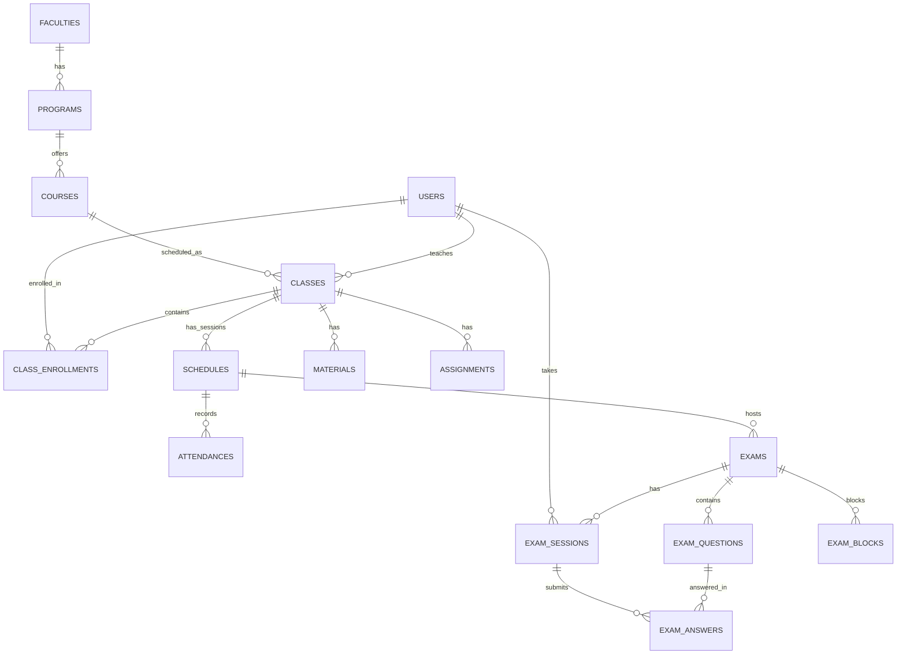
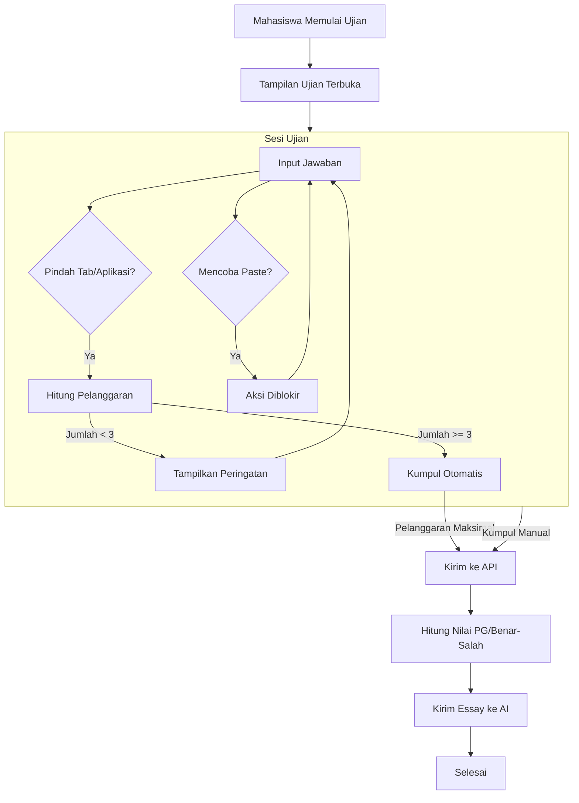
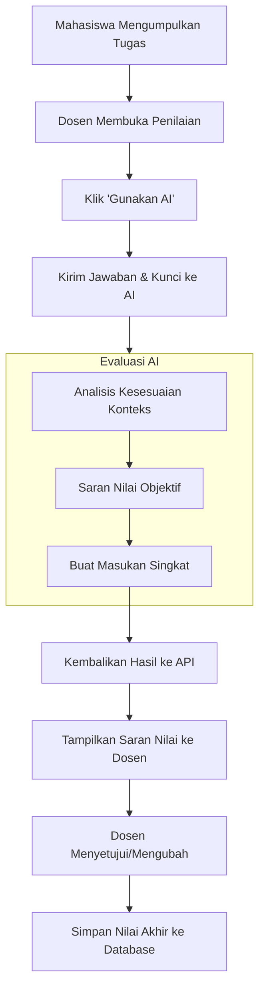

# SIAKAD DKN 🎓

Sistem Informasi Akademik (SIAKAD) berbasis web yang dikembangkan oleh **Dwi Krisnandi**. Aplikasi ini dilengkapi dengan integrasi AI (Artificial Intelligence) dasar untuk membantu mempermudah operasional dosen, mahasiswa, dan proses akademik.

## ✨ Fitur Utama

### 🧑‍🏫 Modul Dosen
- **Manajemen Kelas & Jadwal**: Mengelola jadwal perkuliahan dan mencatat presensi mahasiswa (Hadir, Sakit, Izin, Alpa).
- **Materi & Tugas**: Mendistribusikan materi kelas dan memberikan tugas perkuliahan.
- **Ujian Online (CBT)**: Membuat bank soal dan mengadakan ujian secara online (Pilihan Ganda, Benar/Salah, dan Essay). Dilengkapi sistem deteksi kecurangan dasar (mendeteksi perpindahan tab browser dan memblokir fungsi *copy-paste*).
- **Export DOCX**: Menyimpan soal ujian ke format dokumen Microsoft Word yang siap dicetak.
- **Bantuan Koreksi AI (Auto-Grading)**: Menggunakan integrasi Google Gemini untuk membantu memberikan saran nilai dan masukan singkat pada jawaban essay mahasiswa secara otomatis.
- **Generator AI**: Asisten AI untuk membantu merangkum silabus (RPS) menjadi materi bacaan dan menghasilkan draf soal ujian secara masal.

### 👨‍🎓 Modul Mahasiswa
- **Dashboard Akademik**: Melihat jadwal kelas, riwayat kehadiran, materi, dan kalender tugas.
- **Ujian Online**: Mengerjakan ujian melalui antarmuka responsif. Terdapat batasan peringatan; jika mahasiswa sering berpindah tab atau keluar dari halaman ujian, sistem akan otomatis mengumpulkan jawaban ujian mereka.
- **Chatbot Asisten "Pak Dwi"**: Fitur *chatbot* berbasis AI yang dapat digunakan mahasiswa untuk bertanya dan berdiskusi terkait materi perkuliahan.

### 🛡️ Modul Admin
- **Manajemen Pengguna**: Mengelola data Dosen, Mahasiswa, dan Admin.
- **Manajemen Kurikulum**: Mengelola Fakultas, Program Studi, Mata Kuliah, dan Kelas.
- **Transkrip & Nilai (KHS)**: Pembuatan dokumen hasil ujian dan laporan kelulusan mahasiswa.

## 🏛️ Arsitektur Sistem (Block Diagram)

Diagram berikut mengilustrasikan arsitektur tingkat tinggi dari komponen sistem:



## 🗄️ Entity-Relationship Diagram (ERD)

Struktur inti database dari SIAKAD DKN:



## 🔄 Activity Diagram: Alur Ujian Mahasiswa

Alur pengerjaan ujian online, termasuk logika pemantauan tab/layar saat ujian berlangsung:



## 🔄 Activity Diagram: Bantuan Penilaian AI (Auto-Grading)

Alur penggunaan AI oleh dosen untuk membantu memberikan penilaian jawaban essay mahasiswa:



## ⚙️ System Design & Security Posture

Sistem ini dirancang dengan mengutamakan prinsip *defense-in-depth* dan *fault tolerance* untuk memastikan reliabilitas saat menghadapi beban konkuren tinggi (misalnya saat ujian serentak) serta memitigasi celah keamanan standar.

- **Mitigasi *Thundering Herd* (Client-Side Jittering)**: Diimplementasikan algoritma *randomized jitter* pada *frontend* saat ratusan klien memulai ujian secara bersamaan. Hal ini mendistribusikan *request rate* secara merata dalam rentang waktu tertentu, mencegah *CPU spike* dan *connection timeout* pada API Gateway.
- **Data Minimization & DTO Mapping**: Proses *serialization* data ujian menggunakan pemetaan *Data Transfer Object* (DTO) yang ketat pada *service layer*. *Field* sensitif seperti `correct_answer` secara sistematis di-*strip* (dihapus) sebelum *payload* dikirim melalui jaringan, menjamin *zero-leakage* melalui inspeksi *Network Tab* klien.
- **Offline-First Resilience**: Untuk menanggulangi *intermittent network partitions* (koneksi terputus tiba-tiba), *client architecture* memanfaatkan IndexedDB dan *localStorage* untuk menyimpan *state* ujian sementara. *Payload* jawaban dimasukkan ke dalam antrean lokal (*queue*) dan akan di-*sync* (rekonsiliasi state) secara asinkron ketika konektivitas pulih.
- **State Integrity & Zero Trust**: Menggunakan pendekatan *zero-trust* terhadap input dari klien. Seluruh *state mutation* kritikal (seperti perhitungan skor) dieksekusi secara eksklusif di *server-side*. Klien hanya mengirimkan *event action* (abjad jawaban), sehingga manipulasi *client-side state* tidak akan memengaruhi *ground truth* di database.
- **Access Control & Sanitization**: Otentikasi dan otorisasi ditegakkan pada tingkat *middleware* menggunakan JWT (*stateless auth*) dengan RBAC (*Role-Based Access Control*). *Data Access Layer* menggunakan *parameterized queries* secara komprehensif untuk mencegah kerentanan injeksi SQL.

## 🛠️ Tech Stack

**Frontend (Client)**
* **Framework**: React.js (Vite)
* **Styling**: CSS / Bootstrap, Lucide Icons.
* **Fitur Tambahan**: Progressive Web App (PWA) ready, *Offline-First caching* sederhana, integrasi Firebase Cloud Messaging (FCM).

**Backend (API)**
* **Framework**: Node.js dengan Express.js
* **Database**: PostgreSQL (atau SQLite)
* **Authentication**: JSON Web Token (JWT) & bcryptjs
* **Integrasi AI**: Google Generative AI SDK (`@google/generative-ai`).
* **Dokumen Generator**: library `docx`.

## 🚀 Instalasi & Menjalankan Lokal

Pastikan Anda telah menginstal **Node.js** dan **PostgreSQL/SQLite** di perangkat Anda.

### 1. Clone Repository
```bash
git clone https://github.com/dwikrisnandi/saiakd-dkn.git
cd saiakd-dkn
```

### 2. Setup Backend (API)
```bash
cd api
npm install
```
Konfigurasi *environment variables*. Buat file `.env` di dalam folder `api`:
```env
PORT=3000
DB_HOST=localhost
DB_PORT=5432
DB_USER=postgres
DB_PASSWORD=password_db_anda
DB_NAME=siakad
JWT_SECRET=rahasia_jwt_anda
GEMINI_API_KEY_1=api_key_gemini_anda
```
Jalankan server:
```bash
npm start
```

### 3. Setup Frontend (Client)
Buka terminal baru:
```bash
cd client
npm install
npm run dev
```
Aplikasi frontend akan berjalan di `http://localhost:5173`.

## 📜 Lisensi & Hak Cipta
Dikembangkan oleh **Dwi Krisnandi**.
